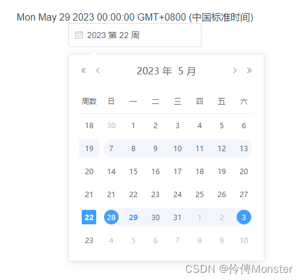
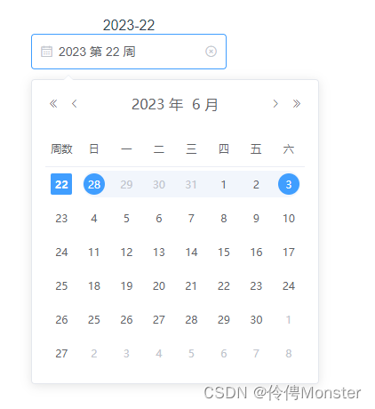
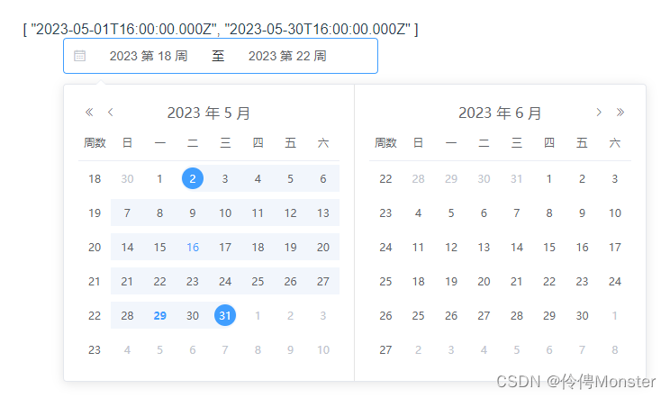
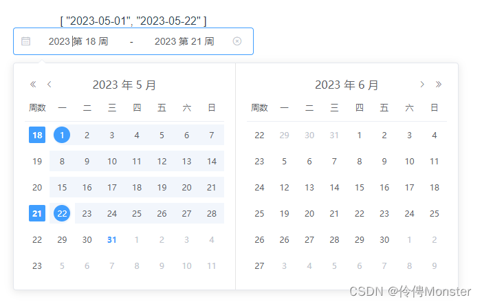
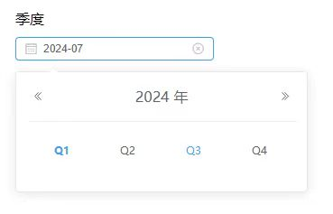
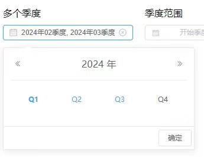
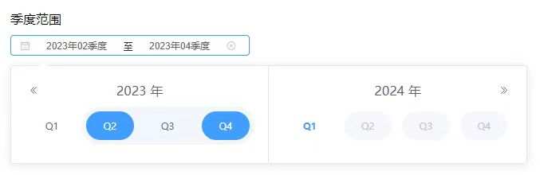
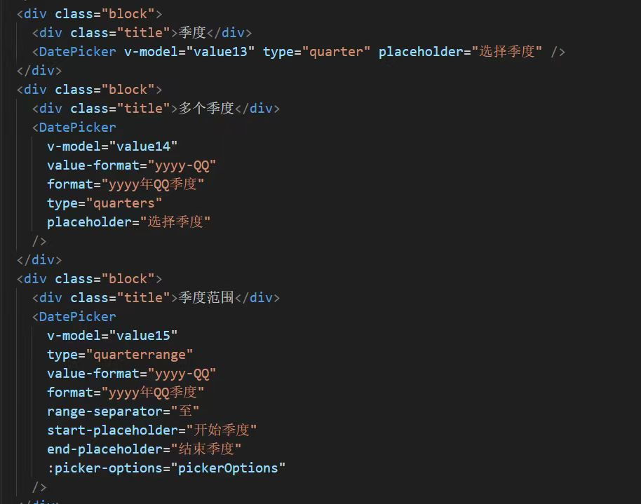
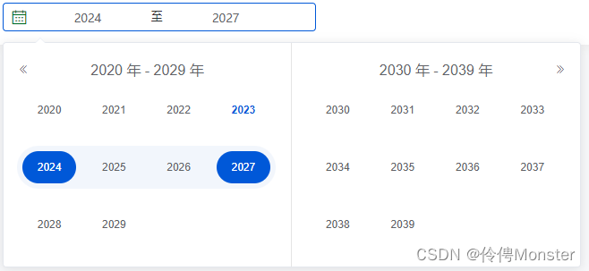
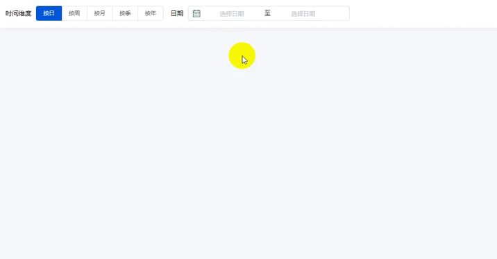

## 背景
在做后台系统的项目中，日期组件用的是比较频繁的，但是一些常用的组件库没那么全。特别使用选择日期范围组件就格外明显。
## 功能

根据 `element-ui(vue2)` 进行完善、改造，功能有：

1. 周选择器完善
2. 周选择日期范围
3. 季度范围选择
4. 季度多选
5. 季度范围选择
6. 年度范围选择
7. 增加【Q/QQ】季度日期格式
## 准备工作

把`element`中的`date-picker`源码复制一份` node_modules\element-ui\packages\date-picker `，然后在`main.js`中使用

```js
import DatePicker from './components/date-picker';
Vue.component('DatePicker', DatePicker);
```

```html
<!--使用 -->
<DatePicker
	v-model="value"
	type="week"
	format="yyyy 第 WW 周"
	placeholder="选择周">
</DatePicker>
```

这个时候会报错，代码无法解析`jsx`语法错误。原因是这个源码中包含时间选择器，这个组件中引入滚动条`ElScrollbar`所以会报错，这里只需要日期选择器，所以注释掉这几行代码不会影响功能，可以自行处理这个问题。

 注释掉 `src/components/date-picker/src/basic/time-spinner.vue line105 和 line109 `

```js
// import ElScrollbar from 'element-ui/packages/scrollbar';
// components: { ElScrollbar },
```

 注释掉 `src/components/date-picker/src/panel/time-select.vue line22 和 line77 `

```js
// import ElScrollbar from 'element-ui/packages/scrollbar';
// components: { ElScrollbar },
```

如果有`eslint`代码检查，需要把` src/components/date-picker `加入到忽略文件中不然会报出很多代码格式的错误和警告 。

## 周选择器完善

###  解决面板不显示周数问题

在`src/components/date-picker/src/basic/date-table.vue`中`props`中接收一个参数`showWeekNumber`这个就是用来显示周数，只是父组件没有传入。

**修改`src\components\date-picker\src\panel\date.vue`**

1. 将`showWeekNumber`绑定到`DateTable`组件中

```vue
<date-table
	v-show="currentView === 'date'"
	@pick="handleDatePick"
	:selection-mode="selectionMode"
	:first-day-of-week="firstDayOfWeek"
	:showWeekNumber="showWeekNumber"
	:value="value"
	:default-value="defaultValue ? new Date(defaultValue) : null"
	:date="date"
	:cell-class-name="cellClassName"
	:disabled-date="disabledDate">
</date-table>
```

2. 让`showWeekNumber`值跟随模式变化

> 代码路径 watch > selectionMode

```js
selectionMode(newVal) {
if (newVal === 'month') {
	//省略
	}  else if(newVal === 'week'){
		this.showWeekNumber = true
	}
}
```

**修改`src\components\date-picker\src\basic\date-table.vue`**

1. 修改表头显示周数，官方使用了国际化(但都注释掉了)，这里直接写死

> 可以在`main.js`中引用`import locale from 'element-ui/lib/locale/lang/zh-CN'`重新改写里面的内容即可

```vue
<!-- 第11行 -->
<tr>
	<th v-if="showWeekNumber">周数</th>
	<th v-for="(week, key) in WEEKS" :key="key">{{ t('el.datepicker.weeks.' + week) }}</th>
</tr>
```

2. 设置行样式激活(行内阴影)，第17行，多了一列周，所以取数2

```text
:class="{ current: isWeekActive(row[showWeekNumber ? 2 : 1]) }"
```

3. 解决选择周后日期错误

> 使用周选择器时，选择后的日期默认是星期一，在西方国家周日则为星期一，所以想要调整可以是使用官方提供的方法 `:picker-options="{firstDayOfWeek:1}"`即可。

4. 解决周数不对问题。152行

```js
if (this.showWeekNumber) {
	row[0] = { type: 'week', text: getWeekNumber(nextDate(startDate, i * 7 + 1)) };
}
```

5. 解决选中周不高亮

```scss
<style lang="scss" scoped>
.el-date-table.is-week-mode tr{
  &.el-date-table__row {
    @mixin week () {
      margin-left: 2px;
      margin-right: 2px;
      border-top-left-radius: 0;
      border-bottom-left-radius: 0;
    }
 
    &.current td.week div {
      font-weight: bold;
      background: #fff;
      color: #fff;
      span {
        background: #409EFF;
        border-radius: 2px;
      }
    }
 
    &:hover td {
      &.week div {
        @include week;
      }
 
      &:nth-of-type(2) div {
        margin-left: 5px;
        border-top-left-radius: 15px;
        border-bottom-left-radius: 15px;
      }
    }
 
    td {
      &.week {
        cursor: unset;
        div {
          @include week;
        }
      }
    }
  }
}
</style>
```




### 解决周选择器无法设置`value-format`

**描述：** 周选择器设置`value-format`后value格式是正确了，但是控制台报错，组件不回显。

**原因：** 从报错信息可以看出来，都是显示获取操作时间函数，因为现在的值是字符串当然没有这些方法，官方没有对周模式进行兼容。

**修改`src\components\date-picker\src\picker.vue`**

经过问题排查发现，在这个文件中有一个计算属性`parsedValue`用于处理`value`值，所以从写此方法。549行。

```js
parsedValue() {
	const yearStartIndex = this.valueFormat ? this.valueFormat.indexOf('yyyy') : -1;
	const weekStartIndex = this.valueFormat ? this.valueFormat.indexOf('WW') : -1;
	const weekStartIndex2 = this.valueFormat ? this.valueFormat.indexOf('W') : -1;
	if (this.value && this.type === 'week' && yearStartIndex > -1 && (weekStartIndex > -1 || weekStartIndex2 > -1)) {
		const year = parseInt(this.value.substring(yearStartIndex, yearStartIndex + 4))
        const week = parseInt(this.value.substring((weekStartIndex > -1 ? weekStartIndex : weekStartIndex2)).replace(/(\d{1,2}).*/g, '$1'))
        const firstWeekDayOfYear = new Date(year, 0, 1).getDay()
        let firstThursday = null
        if (firstWeekDayOfYear <= 4) {
			firstThursday = new Date(year, 0, 1 + (4 - firstWeekDayOfYear))
        } else {
          firstThursday = new Date(year, 0, 1 + (11 - firstWeekDayOfYear))
        }
        const weekOfThursday = new Date(firstThursday.getTime() + (1000 * 60 * 60 * 24 * 7 * (week - 1)))
        return weekOfThursday
      }else{
        if (!this.value) return this.value; // component value is not set
        if (this.type === 'time-select') return this.value; // time-select does not require parsing, this might change in next major version

        const valueIsDateObject = isDateObject(this.value) || (Array.isArray(this.value) && this.value.every(isDateObject));
        if (valueIsDateObject) {
          return this.value;
        }

        if (this.valueFormat) {
          return parseAsFormatAndType(this.value, this.valueFormat, this.type, this.rangeSeparator) || this.value;
        }

        // NOTE: deal with common but incorrect usage, should remove in next major version
        // user might provide string / timestamp without value-format, coerce them into date (or array of date)
        return Array.isArray(this.value) ? this.value.map(val => new Date(val)) : new Date(this.value);
      }
}
```

重写后支持`value-format`属性




## 周选择日期范围

**思路：** 通过这个`src\components\date-picker\src\picker\date-picker.js`文件可以发现`element`做了几个模式然后通过不同的type获取不同的日期面板，所以可以把日模式日期选择改造一下作为一个新模式。

为了不影响现有功能，把代码复制一份进行改造。

### 复制文件并新增`weekrange`模式

1. 复制`src\components\date-picker\src\panel\date-range.vue` 命名为`week-range.vue`
2. 在`src\components\date-picker\src\picker\date-picker.js`中新增`weekrange`模式

```js
import WeekRange from '../panel/week-range'

const getPanel = function(type) {
  if (type === 'daterange' || type === 'datetimerange') {
    return DateRangePanel;
  } else if (type === 'monthrange') {
    return MonthRangePanel;
  }else if(type === 'weekrange'){
    return WeekRange
  }
  return DatePanel;
};
```

### 新增基础配置数据

 `src\components\date-picker\src\picker.vue`

- 添加周范围默认时间格式，110行

```js
const DEFAULT_FORMATS = {
  weekrange: 'yyyywWW'
};
```

- 添加触发类型，124行

```js
const HAVE_TRIGGER_TYPES = [
  'weekrange'
];
```

- 添加类型值映射解析器，171行

```js
const TYPE_VALUE_RESOLVER_MAP = {
	weekrange: {
		formatter(value, format) {
			if (Array.isArray(value) && value.length === 2) {
				return [WEEK_FORMATTER(value[0], format), WEEK_FORMATTER(value[1], format)];
			}
      		return '';
		},
    	parser(value, format) {
        	if(Array.isArray(value) && value.length === 2){
          		return [TYPE_VALUE_RESOLVER_MAP.date.parser(value[0], format),TYPE_VALUE_RESOLVER_MAP.date.parser(value[1], format)];
        }
      		return []
    	},
  },
}

const WEEK_FORMATTER = function (value, format) {
  let week = getWeekNumber(value);
  let month = value.getMonth();
  const trueDate = new Date(value);
  if (week === 1 && month === 11) {
    trueDate.setHours(0, 0, 0, 0);
    trueDate.setDate(trueDate.getDate() + 3 - ((trueDate.getDay() + 6) % 7));
  }
  let date = formatDate(trueDate, format);

  date = /WW/.test(date) ? date.replace(/WW/, week < 10 ? '0' + week : week) : date.replace(/W/, week);
  return date;
};
```

- 修改样式

在`src\components\date-picker\src\picker.vue`这个文件中，最外层有个样式是通过`type`生成的，所以生成的`el-date-editor--weekrange`没有这个样式，所以文本框就很短。

```scss
<style lang="scss" scoped>
.el-date-editor--weekrange.el-input__inner{
  width: 350px;
}
</style>
```

### 开启周数显示

**修改：`src\components\date-picker\src\panel\week-range.vue`** 

在`date-table`中添加`showWeekNumber=true`，记得两个都要添加




### 支持`value-format`

根据上文的处理方法，现在是数组数据处理。

```js
//提取处理方法
parseWeekValue(year,week){
	const firstWeekDayOfYear = new Date(year, 0, 1).getDay()
	let firstThursday = null
	if (firstWeekDayOfYear <= 4) {
		firstThursday = new Date(year, 0, 1 + (4 - firstWeekDayOfYear))
	} else {
		firstThursday = new Date(year, 0, 1 + (11 - firstWeekDayOfYear))
	}
	return new Date(firstThursday.getTime() + (1000 * 60 * 60 * 24 * 7 * (week - 1)))
}
```

```js
//改造计算属性中的parsedValue方法
parsedValue() {
	const yearStartIndex = this.valueFormat ? this.valueFormat.indexOf('yyyy') : -1;
	const weekStartIndex = this.valueFormat ? this.valueFormat.indexOf('WW') : -1;
	const weekStartIndex2 = this.valueFormat ? this.valueFormat.indexOf('W') : -1;
	if (this.value && this.type === 'week' && yearStartIndex > -1 && (weekStartIndex > -1 || weekStartIndex2 > -1)) {
		const year = parseInt(this.value.substring(yearStartIndex, yearStartIndex + 4))
        const week = parseInt(this.value.substring((weekStartIndex > -1 ? weekStartIndex : weekStartIndex2)).replace(/(\d{1,2}).*/g, '$1'))
        return this.parseWeekValue(year,week)
	}else if(Array.isArray(this.value) && this.type === 'weekrange' && yearStartIndex > -1 && (weekStartIndex > -1 || weekStartIndex2 > -1)){
		return this.value.map(date=>{
			const year = parseInt(date.substring(yearStartIndex, yearStartIndex + 4))
			const week = parseInt(date.substring((weekStartIndex > -1 ? weekStartIndex : weekStartIndex2)).replace(/(\d{1,2}).*/g, '$1'))
			return this.parseWeekValue(year,week)
		})
	}else{
		if (!this.value) return this.value; // component value is not set
        if (this.type === 'time-select') return this.value; // time-select does not require parsing, this might change in next major version

        const valueIsDateObject = isDateObject(this.value) || (Array.isArray(this.value) && this.value.every(isDateObject));
        if (valueIsDateObject) {
			return this.value;
		}

		if (this.valueFormat) {
          return parseAsFormatAndType(this.value, this.valueFormat, this.type, this.rangeSeparator) || this.value;
        }

        // NOTE: deal with common but incorrect usage, should remove in next major version
        // user might provide string / timestamp without value-format, coerce them into date (or array of date)
        return Array.isArray(this.value) ? this.value.map(val => new Date(val)) : new Date(this.value);
      }
},
```

### 周高亮

> 思路：在单个周选择器中发现`el-date-table`这个层级上启用`is-week-mode`，在`el-date-table__row`样式行中加上`current`这个类名就可以高亮显示

- 复制文件重新修改逻辑

复制`src\components\date-picker\src\basic\date-table.vue`命名为`week-range-table.vue`在`week-range.vue`中引用这个组件

- 显示`is-week-mode`

`src\components\date-picker\src\basic\week-range-table.vue`第一行，以为这是复制出的一份，不做处理直接写死

```vue
<table cellspacing="0" cellpadding="0" class="el-date-table is-week-mode" @click="handleClick" @mousemove="handleMouseMove"></table>
```

- 显示`current`

这个样式由`isWeekActive`这个方法控制，所以需要重写逻辑。很简单，传入行，判断当前行有没有start或者end。

```js
:class="{ current: isWeekActive(row) }"

isWeekActive(row) {
	return row.find(v=>v.start) || row.find(v=>v.end)
}
```


## 季选择日期范围

## 季度多选

## 季度范围选择

## Q/QQ日期格式

## 年选择日期范围

## 完整功能展示



[书洞笔记](https://mp.weixin.qq.com/s/4X-Hk7CwrjdNfJRdP5EPQw)
