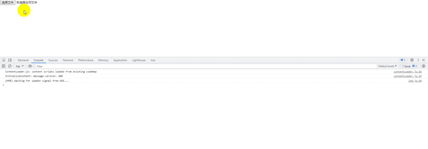

### 需求

在做视频上传时一般会上传一张图片作为封面图，这时就可以获取视频的一些封面帧，选择一帧当作封面图；同样在页面展示的时候视频没有封面图，也可以通过这种方法去截取一帧图，提高用户体验。

### 思路

1、获取视频文件

2、跳转到对应帧

3、使用canvas把对应帧画出来

4、最后返回对应的数据

### 获取视频文件

- 页面文件框

  ```html
  <input type="file" accept="video/*" ref="vdoFileRef" @change="changeFile" />
  ```

- 获取视频文件

  ```js
  async changeFile(e) {
  	let file = e.target.files[0];
  	let vdo = document.createElement('video');
  	vdo.src = URL.createObjectURL(file);
  }
  ```

### 关键帧操作

封装一个函数用来操作关键帧

```js
captureFrame(vdo, time = 0) {
	return new Promise((resolve, reject) => {
        vdo.currentTime = time;
        vdo.muted = true;
        vdo.autoplay = true;
        vdo.oncanplay = () => {
          
        };
      });
},
```

这个函数需要传入视频文件和视频秒数，视频跳转到对应秒数，静音自动播放，这样在任何浏览器都可以支持，由于视频没有添加到页面所以跳转到对应秒数后不会自动播放，最后监听事件，视频可以播放后执行后续操作。oncanplay是异步操作，使用Promise包裹一层返回。

### 绘制关键帧

```js
drawVideo(vdo) {
	return new Promise((resolve, reject) => {
		let cvs = document.createElement('canvas');
		let ctx = cvs.getContext('2d');
		cvs.width = vdo.videoWidth;
		cvs.height = vdo.videoHeight;
		ctx.drawImage(vdo, 0, 0, cvs.width, cvs.height);
		cvs.toBlob((blob) => {
			resolve({
				blob,
				url: URL.createObjectURL(blob),
			});
		});
	});
},
```

canvas是可以画视频的，所以把视频传入，根据视频大小画出当前帧，最后使用toBlob()返回想要的数据，这里返回两个数据blob可用于封面上传，url可用于预览，由于toBlob是异步操作，使用Promise包裹一层返回。

### 使用

在oncanplay里调用绘制关键帧的函数

```js
vdo.oncanplay = async () => {
	let frame = await this.drawVideo(vdo);
	resolve(frame);
};
```

最后就是在选择文件后根据要求调用函数生成对应的封面图

```js
async changeFile(e) {
	let file = e.target.files[0];
	let vdo = document.createElement('video');
	vdo.src = URL.createObjectURL(file);
    // 间隔1秒生成10张封面图
	for (let i = 0; i < 10; i++) {
		let frame = await this.captureFrame(vdo, i * 1);
		this.list.push(frame);
	}
}
```



[书洞笔记](https://mp.weixin.qq.com/s/PvxGQ8TvzZIp_5WzY7699A)
