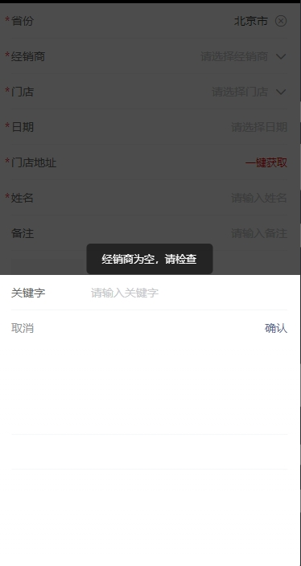
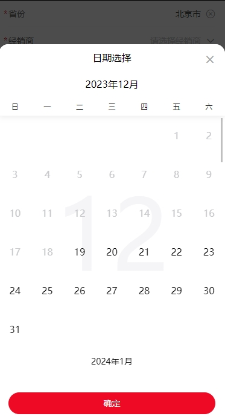
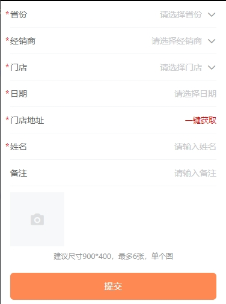
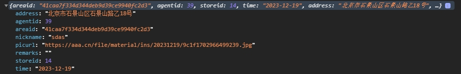
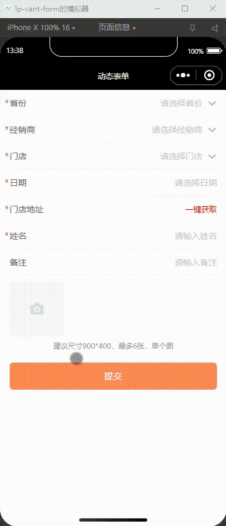

`lp-vant-form` 是一个可以通过 `JSON` 生成具有动态渲染、数据收集、验证和提交功能的表单生成组件。

## 功能

- 依赖 `Vant Weapp` `UI` 组件库
- 通过 `JSON` 生成表单
- 支持数据联动
- 数据验证
- 数据处理
- 内置组件
  - input
  - picker
  - date
  - upload
  - address

## 属性rule

通过 `JSON` 快速的配置表单项规则。内置多种场景、功能的表单组件，轻松搞定表单流程收集。

### 配置input

返回值 `string` ：输入框文本值

| 参数        | 说明                        | 类型          | 默认值                                 | 备注 |
| ----------- | --------------------------- | ------------- | -------------------------------------- | ---- |
| type        | 表单类型`input`             | string        |                                        | 必填 |
| field       | 字段名                      | string        |                                        | 必填 |
| title       | 字段名称                    | string        |                                        | 必填 |
| value       | 当前值                      | string/number |                                        |      |
| required    | 是否必填                    | boolean       | false                                  |      |
| readonly    | 是否只读                    | boolean       | false                                  |      |
| disabled    | 是否禁用                    | boolean       | false                                  |      |
| placeholder | 输入框为空时占位符          | string        |                                        |      |
| dataType    | 输入框类型`text` `textarea` | string        | text                                   |      |
| format      | 格式化文本                  | function      |                                        |      |
| validate    | 字段验证                    | function      | 如果没有检验方法则以required来判空校验 |      |
| message     | 字段错误提示                | string        |                                        |      |

#### 示例

```js
{
	type: 'input',
	field: 'nickname',
	title: '姓名',
	required: true,
	placeholder: '请输入姓名',
	message: '请输入姓名'
}
```


### 配置picker

返回值 `object` ：当前选中的数据项，在原有数据源上增加 `id` 和 `name` 属性

| 参数        | 说明               | 类型     | 默认值                                 | 备注                              |
| ----------- | ------------------ | -------- | -------------------------------------- | --------------------------------- |
| type        | 表单类型`picker`   | string   |                                        | 必填                              |
| field       | 字段名             | string   |                                        | 必填                              |
| title       | 字段名称           | string   |                                        | 必填                              |
| value       | 当前值             | object   |                                        | id : 1<br />name : '张三'         |
| required    | 是否必填           | boolean  | false                                  |                                   |
| disabled    | 是否禁用           | boolean  | false                                  |                                   |
| placeholder | 输入框为空时占位符 | string   |                                        |                                   |
| options     | 下拉选项           | array    |                                        | options与fetch互斥，fetch优先级高 |
| fetch       | 选项接口数据       | object   | 见fetch表                              | options与fetch互斥，fetch优先级高 |
| props       | 配置选项           | object   | 见props表                              |                                   |
| format      | 格式化数据         | function |                                        |                                   |
| validate    | 字段验证           | function | 如果没有检验方法则以required来判空校验 |                                   |
| message     | 字段错误提示       | string   |                                        |                                   |

#### props

options默认选项数据使用 id 和 name 属性，属性不一致需要使用props指定某个属性，指定后会在原有数据中添加 id 和 name 属性。

| 参数  | 说明     | 类型   | 默认值 | 备注 |
| ----- | -------- | ------ | ------ | ---- |
| id    | 数据项id | string | id     |      |
| label | 显示标签 | string | name   |      |

#### fetch

| 参数    | 说明       | 类型     | 默认值           | 备注                                                         |
| ------- | ---------- | -------- | ---------------- | ------------------------------------------------------------ |
| action  | 接口地址   | string   |                  | 必填                                                         |
| method  | 请求方法   | string   |                  |                                                              |
| data    | 携带数据   | object   |                  |                                                              |
| headers | header信息 | object   |                  |                                                              |
| parse   | 解析函数   | function |                  | 需要处理为数组返回，如果返回值是无效的会提示报错，所以这里面可以做一些逻辑判断 |
| link    | 依赖参数   | array    | 见`fetch.link`表 |                                                              |

#### fetch link

请求参数依赖与其它参数时，需要指定来源与哪个字段，如果是picker这样的数据是对象则需要指定取哪个属性，最后通过`params`指定data中的参数。依赖数据变更清除所有有关联字段的数据。

| 参数     | 说明          | 类型   | 默认值 | 备注                                 |
| -------- | ------------- | ------ | ------ | ------------------------------------ |
| field    | 来源字段      | string | ——     | 取最外层的field字段名                |
| fieldVal | 字段数据      | string | ——     | 如果来源数据是对象，需要指定取哪个值 |
| params   | fetch请求参数 |        |        |                                      |

#### 示例

```js
{
	type: 'picker',
	field: 'storeid',
	title: '门店',
	required: true,
	placeholder: '请选择门店',
	message: '请选择门店',
	fetch: {
		action: '',
		method: 'post',
		data: {
			a: ''
		},
		link: [{
			field: 'areaid',
			fieldVal: 'areaid',
			params: 'areaid'
		},
		{
			field: 'agentid',
			fieldVal: 'agentid',
			params: 'agentid'
		}],
		parse: res => {
			return res.data
		}
	},
	format: val => {
		return val['storeid']
	},
	props: {
		id: 'storeid',
		label: 'name'
	}
}
```


### 配置upload

返回值 `array` ：图片地址

| 参数     | 说明             | 类型         | 默认值              | 备注                  |
| -------- | ---------------- | ------------ | ------------------- | --------------------- |
| type     | 表单类型`upload` | string       |                     | 必填                  |
| field    | 字段名           | string       | ——                  | 必填                  |
| title    | 字段名称         | string       | ——                  |                       |
| max      | 文件上传数量限制 | number       | 12                  |                       |
| capture  | 上传类型         | string/array | ['album', 'camera'] | 新增`delay`延时拍照   |
| example  | 示例图           | array        |                     | 属性`url`、 `content` |
| tips     | 上传规则提示     | string       |                     |                       |
| fetch    | 文件上传         | object       | 见fetch表           |                       |
| format   | 数据格式化       | function     |                     |                       |
| validate | 字段验证         | function     |                     |                       |
| message  | 字段错误提示     | string       |                     |                       |

#### fetch

| 参数    | 说明           | 类型     | 默认值 | 备注       |
| ------- | -------------- | -------- | ------ | ---------- |
| action  | 接口地址       | string   |        | 必填       |
| data    | 携带数据       | object   |        |            |
| headers | header信息     | object   |        |            |
| name    | 文件对应的 key | string   |        |            |
| parse   | 解析函数       | function |        | 须有返回值 |

#### 示例

```js
{
	type: 'upload',
	field: 'picurl',
	message: '请至少上传两张照片'
	fetch: {
		action: '',
		name: 'file',
		headers: {},
		data: {},
		parse: res => {
			return 'https://aaa.com/file/' + res.data
		}
	},
	tips:'建议尺寸900*400，最多6张，单个图',
	example:[],
	validate: res => {
		return res.length > 1
	},
	format: res => {
		return res.join(',')
	}
}
```

### 配置address

返回值 `string` ： 地址字符串

| 参数     | 说明               | 类型     | 默认值   | 备注                                                         |
| -------- | ------------------ | -------- | -------- | ------------------------------------------------------------ |
| type     | 表单类型 `address` | string   |          | 必填                                                         |
| field    | 字段名             | string   |          | 必填                                                         |
| title    | 字段名称           | string   |          | 必填                                                         |
| required | 是否必填           | boolean  | false    |                                                              |
| mode     | 模式               | string   | 见mode表 | 必填                                                         |
| source   | 数据来源           | object   |          | 属性一：field-来源字段<br />属性二：fieldVal-数据取数（如果来源字段是对象需要指定取数字段属性） |
| format   | 格式化数据         | function |          |                                                              |
| validate | 字段验证           | function |          |                                                              |
| message  | 字段错误提示       | string   |          |                                                              |

#### mode

> 地址显示使用到 `wx.getLocation` `wx.chooseLocation` 所以需要获取到对应的权限及配置方能使用

| 模式   | 说明     | 备注                                                         |
| ------ | -------- | ------------------------------------------------------------ |
| auto   | 自动定位 | 使用 `qqmap-wx-jssdk` 进行坐标解析，达到自动定位，需要在后台加入请求接口白名单 |
| rely   | 来源获取 | 例如：我选择门店，通过门店带出门店地址，则可以使用这个模式   |
| choose | 选择地址 | 使用 `wx.getLocation` `wx.chooseLocation` 来选择地址         |

#### 示例

```js
{
	type: 'address',
	field: 'address',
	title: '门店地址',
	mode: 'rely', //auto,rely,choose
	required: true,
	message:'请获取门店地址',
	source: {
		field: 'storeid',
		fieldVal: 'addres'
	}
},
```

### 配置date

返回值 `string | array` ： 当 `mode` 为`multiple`或`range`时为数组 ，其它类型为字符串

| 参数        | 说明                                                         | 类型          | 默认值             | 备注                                   |
| ----------- | ------------------------------------------------------------ | ------------- | ------------------ | -------------------------------------- |
| type        | 表单类型 `date`                                              | string        |                    | 必填                                   |
| field       | 字段名                                                       | string        |                    | 必填                                   |
| title       | 字段名称                                                     | string        |                    | 必填                                   |
| placeholder | 输入框为空时占位符                                           | string        |                    |                                        |
| minDate     | 可选择的最小日期                                             | timestamp     | 当前日期           |                                        |
| maxDate     | 可选择的最大日期                                             | timestamp     | 当前日期的六个月后 |                                        |
| maxRange    | 日期区间最多可选天数                                         | number/string | 无限制             | 当mode为range时生效                    |
| separator   | 日期格式                                                     | string        | -                  | 如 2023-12-18                          |
| required    | 是否必填                                                     | boolean       | false              |                                        |
| disabled    | 是否禁用                                                     | boolean       | false              |                                        |
| mode        | 选择类型:<br/>`single`表示选择单个日期<br/>`multiple`表示选择多个日期<br/>`range`表示选择日期区间<br/>`auto` 表示自动时间 | string        | single             | 当mode为auto时，其它针对性的配置不生效 |
| format      | 格式化文本                                                   | function      |                    |                                        |
| validate    | 字段验证                                                     | function      |                    |                                        |
| message     | 字段错误提示                                                 | string        |                    |                                        |

#### 示例

```js
{
	type: 'date',
	field: 'time',
	title: '日期',
	required: true,
	placeholder: '请选择日期',
	message: '请选择日期'
}
```


## 实战


```html
<lp-vant-form rule="{{rule}}" bind:submit="submit"></lp-vant-form>
```

```javascript
[
{
        type: 'picker',
        field: 'areaid',
        title: '省份',
        required: true,
        placeholder: '请选择省份',
        message: '请选择省份'
        fetch: {
          action: 'xxxx',
          method: 'post',
          parse: res => {
            return res.data
          }
        },
        format: val => {
          return val['areaid']
        },
        props: {
          id: 'areaid',
          label: 'name'
        }
      },
      {
        type: 'picker',
        field: 'agentid',
        title: '经销商',
        required: true,
        placeholder: '请选择经销商',
        message: '请选择经销商',
        fetch: {
          action: 'xxxx',
          method: 'post',
          link: [{
            field: 'areaid',
            fieldVal: 'areaid',
            params: 'areaid'
          }],
          parse: res => {
            return res.data
          }
        },
        format: val => {
          return val['agentid']
        },
        props: {
          id: 'agentid',
          label: 'name'
        }
      },
      {
        type: 'picker',
        field: 'storeid',
        title: '门店',
        required: true,
        placeholder: '请选择门店',
        message: '请选择门店',
        fetch: {
          action: 'xxxxx',
          method: 'post',
          data: {
            a: ''
          },
          link: [{
              field: 'areaid',
              fieldVal: 'areaid',
              params: 'areaid'
            },
            {
              field: 'agentid',
              fieldVal: 'agentid',
              params: 'agentid'
            }
          ],
          parse: res => {
            return res.data
          }
        },
        format: val => {
          return val['storeid']
        },
        props: {
          id: 'storeid',
          label: 'name'
        }
      },
       {
        type: 'date',
        field: 'time',
        title: '日期',
        required: true,
        placeholder: '请选择日期',
        message: '请选择日期'
      },
       {
        type: 'address',
        field: 'address',
        title: '门店地址',
        mode: 'rely', 
        required: true,
        message: '请获取门店地址',
        source: {
          field: 'storeid',
          fieldVal: 'addres'
        }
      },
       {
        type: 'input',
        field: 'nickname',
        title: '姓名',
        required: true,
        placeholder: '请输入姓名',
        message: '请输入姓名'
      },
       {
        type: 'input',
        field: 'remarks',
        title: '备注',
        placeholder: '请输入备注'
      },
      {
        type: 'upload',
        field: 'picurl',
        fetch: {
          action: 'xxxx',
          name: 'file',
          headers: {},
          data: {},
          parse: res => {
            return 'https://xxxxx.cn/file/' + res.data
          }
        },
        tips: '建议尺寸900*400，最多6张，单个图',
        message: '请至少上传一张照片',
        example: [],
        validate: res => {
          return res.length > 0
        },
        format: res => {
          return res.join(',')
        }
      }
]
```




[书洞笔记](https://mp.weixin.qq.com/s/sbm6BL2pUO2ToTR02zCp8w)
