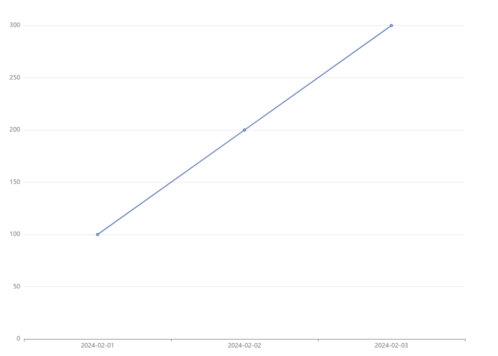

## 背景
在做后台系统以及关于数据分析处理的项目中，图表的功能就必不可少，而目前市场上Echarts的使用占比还是比较高的，如何灵活低成本使用就尤为重要。
## 设计
通过把图表的数据、业务、组件解耦，这样可以达到高复用、易于维护。
## 编写组件
1. 图表容器

可以从外部接收容器宽高。
```html
<template>
  <div
    ref="chart"
    class="chart"
    :style="`--height:${height}px;--width:${width ? width + 'px' : '100%'}`"
  />
</template>
```

```js
  props: {
    height: {
      type: Number,
      default: 300
    },
    width: {
      type: Number,
      default: null
    }
  }
```

```scss
<style lang="scss" scoped>
.chart {
  width: var(--width);
  height: var(--height);
}
</style>
```
2. 基础功能
```js
<script>
//引入包
import * as echarts from 'echarts'
export default {
	name: 'ChartModel',
	props: {
    	height: {
      		type: Number,
      		default: 300
    	},
    	width: {
      		type: Number,
      		default: null
    	}
	},
	data() {
    	return {
      		chart: {}
    	}
  	},
  	mounted() {
		this.initChart()
	}，
	beforeDestroy() {
    	this.chart.clear()
    	this.chart.dispose()
    	this.chart = {}
  	},
  	 methods: {
  	 	//初始化图表
		initChart() {
      		this.chart = echarts.init(this.$refs.chart)
      		this.chart.resize()
    	},
    	//更新图表
    	setOptions(options) {
      		this.chart.clear()
      		this.chart.hideLoading()
      		this.chart.setOption(options)
    	},
    	//空图表
    	emptyOptions() {
      		this.chart.clear()
      		this.chart.hideLoading()
      		this.chart.setOption({
        		title: {
          			text: '暂无数据',
          			x: 'center',
          			y: 'center',
          			textStyle: {
            			color: '#0058D8',
            			fontWeight: 'normal',
            			fontSize: 16
          			}
        		}
      		})
    	},
    	//图表加载动画
		showLoading() {
      		this.chart.showLoading('default', {
        		text: '加载中...',
        		color: '#0058D8',
        		textColor: '#0058D8',
        		maskColor: 'rgba(255, 255, 255, 0)'
      		})
    	}
	}
}
</script>
```
从methods中可以看到提供三个方法：setOptions（设置图表）、emptyOptions（设置空图表）、showLoading（开启加载动画）。

这里把图表数据提取出来，可以通过获取图表组件实例去进行图表渲染。

3. 响应式图表

相应式图表就比较容易了，通过监听resize事件使用Echarts中的resize方法即可，但需要注意的是项目中有侧边栏折叠的需要额外处理。我这里写成mixins，可以根据自己写
```js
//resize事件简易代码
this.$_resizeHandler = debounce(() => {
	this.chart.resize()
}, 100)
window.addEventListener('resize', this.$_resizeHandler)
```

```js
//侧边栏简易代码
$_sidebarResizeHandler(e) {
	if (e.propertyName === 'width') {
		this.$_resizeHandler()
	}
},
//获取侧边栏
this.$_sidebarElm = document.getElementsByClassName('sidebar-container')[0]
//侧边栏是有动画的，所以可以监听transitionend事件
this.$_sidebarElm && this.$_sidebarElm.addEventListener('transitionend', this.$_sidebarResizeHandler)
```

4. 解决图表宽度100问题

图表宽度100问题一般出现在组件切换的时候，display从none变为block的时候获取不到宽度。

从网上搜解决方法的话一般就是使用v-if、设置图表的宽度等，但我想使用一种更加灵活智能的方法去实现。既然知道是由于display变化获取不到宽度，也知道可以通过Echarts的resize重新渲染，那么我只需要在切换的时候调一下resize方法不就好了吗，但是感觉使用成本挺高的，项目中使用图表很多，切换也很多，那我每次都需要写这么一句代码，这就跟 "灵活、智能" 没太大关系了，后来考虑到可以使用[MutationObserver](https://developer.mozilla.org/zh-CN/docs/Web/API/MutationObserver)来实现。

```js
//这个ob全局都要用，没必要放在data中
var ob = null
//加入一个props
props:{
	...
	// 祖先终止元素
    watchDom: {
      type: String,
      default: ''
    }
},
mounted() {
    this.initChart()
    // 解决宽度100问题,监听图表元素的祖先元素的display变化，变化则执行resize方法
    ob = new MutationObserver((mutationsList) => {
      for (const mutation of mutationsList) {
        if (mutation.type === 'attributes' && mutation.attributeName === 'style') {
          const isVisible = window.getComputedStyle(mutation.target).display !== 'none'
          if (isVisible) this.chart.resize()
        }
      }
    })
    const domList = this.findAncestor(this.$el)
    for (let i = 0; i < domList.length; i++) {
      ob.observe(domList[i], { attributes: true })
    }
},
  beforeDestroy() {
    this.chart.clear()
    this.chart.dispose()
    this.chart = {}
    //停止观察
    ob.disconnect()
  },
```

```js
// 找到当前元素到祖先终止元素的所有元素
findAncestor(element) {
      const endDom = this.watchDom ? document.querySelector(this.watchDom) : this.$parent.$el
      var ancestors = [] // 存放祖先元素的数组
      while (element.parentNode !== null) {
        ancestors.push(element)
        if (element === endDom) break // 找到指定终止元素后跳出循环
        element = element.parentNode
      }
      return ancestors
    }
```
**分析：** 既然是由于父级元素display变化引起的，那我监听当前图表的父级元素即可，如果没有传入终止条件的话，就只会找到父级，传入终止条件的话就会多监听一些元素。这样这些父级元素的display变化就会重新渲染就可以解决宽度100的问题了。从性能上考虑还可以，正常情况下一个页面可能也就监听几个dom元素吧，只要一个页面中的图表不是太多，图表层级不深都没什么影响。

这里使用这种方法只事给大家提供一个思路，大家有其它的想法可以讨论一下。

## 使用组件
- 准备数据
```js
//可以根据页面准备一个配置js-chartOptions.js
export const test = {
	xAxis: {
    	type: 'category',
    	data: []
  	},
  	yAxis: {
    	type: 'value'
  	},
  	series: [
    	{
      		data: [],
      		type: 'line'
    	}
  	]
}
```

- 业务使用
```html
<ChartModel ref="chartRef" :height="360" />
```
```js
import ChartModel from '@/components/ChartModel'
//引入图表配置
import { test } from './chartOptions'
//图表渲染
filterChart(){
	//模拟数据，根据实际接口数据为准
	let list = [
		{
			date:'2024-02-01',
			value:100
		},
		{
			date:'2024-02-02',
			value:200
		},
		{
			date:'2024-02-03',
			value:300
		}
	]
	//获取实例
	const chartInstance = this.$refs.chartRef
	//数据为空显示空图表
	if (list.length === 0) {
		chartInstance.emptyOptions()
		return
	}
	//处理数据
	const xData = list.map((item) => item.date)
    const value= list.map((item) => item.value) 
    //修改数据
    test.xAxis[0].data = xData
    test.series[0].data = value
    chartInstance.setOptions(test)
}
```



[书洞笔记](https://mp.weixin.qq.com/s/XpO7zEu_qNrlhwgIU3LO9g)
