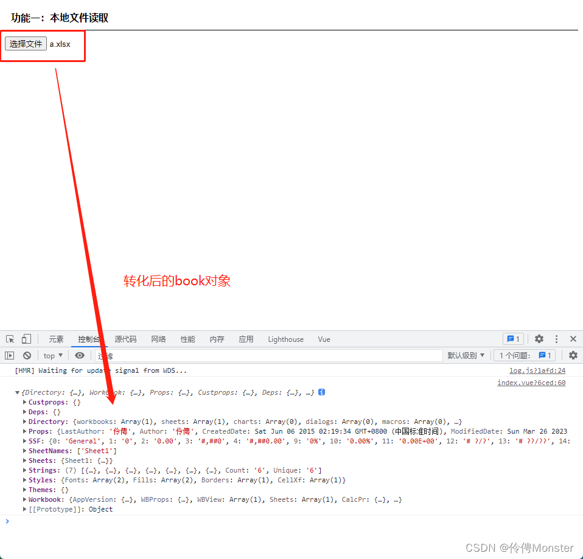
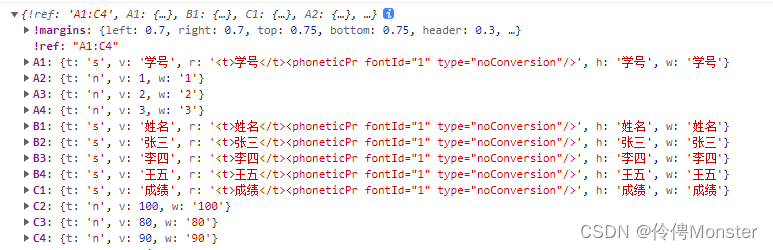
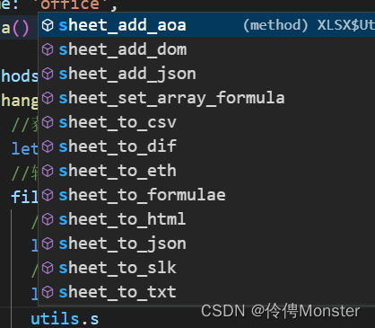
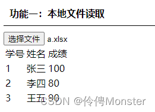
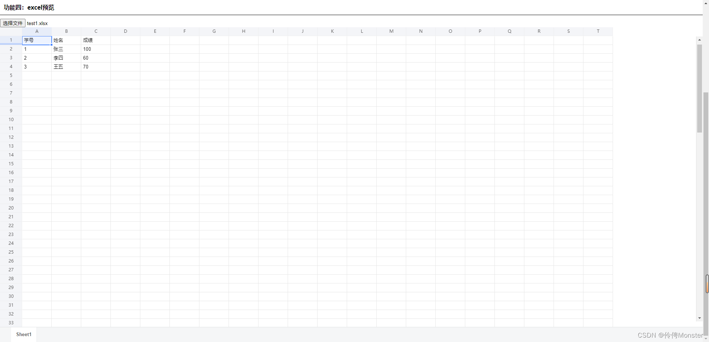

### 背景介绍

对于日常开发中后台系统项目中，肯定避免不了对文件的操作；文件上传、预览等功能。为了用户体验、交互，你也需要这些知识。

### Excel操作(xlsx)

```bash
# 安装xlsx
npm i xlsx
```

xlsx提供了很多文件的操作方式，这里说一下常见的三种处理方式：

- Bolo文件流
- html Dom对象
- json 对象

1. 功能一：文件读取

> **处理流程：**
>
> 1. Bolo文件流可以是后台接口返回的也可以通过input选择的
> 2. 通过arrayBuffer处理文件
> 3. 然后将这个Buffer交给xlsx的方法读取为book对象
> 4. 提取出对应的sheet对象
> 5. 格式转化

```vue
<input type="file" name="file" @change="change">
```

```js
//引入xlsx工具
import { read, writeFile, utils } from 'xlsx'

change(e) {
	//获取文件
	let file = e.target.files[0]
	//转化为arrayBufferr
	file.arrayBuffer().then(res => {
		//读取book对象
		let wb = read(res)
		console.log(wb);
	})
}
```


这个对象里有一些重要的属性：sheets表示excel里有那些表，详细的记录了表里的数据。

sheets里面目前就只有一张sheet1这张表，直接取出

```js
change(e) {
	//获取文件
	let file = e.target.files[0]
	//转化为arrayBufferr
	file.arrayBuffer().then(res => {
		//读取book对象
		let wb = read(res)
		 //取出sheet1表
        let sheet = wb.Sheets.Sheet1
        console.log(sheet);
	})
}
```

由于取出的表数据不易查看，那就需要借助xlsx的utils进行转换


这个就是提供的sheet转化为容易看懂的数据，方法命名就很人性话容易了解.

- sheet_to_html：转化为html格式
- sheet_to_json：转化为json格式

这里就把数据转化为html格式渲染到页面上去

```vue
<div class="title">功能一：本地文件读取</div>
<input type="file" name="file" @change="change">
<div class="excel-content" v-html="htmlDOM"></div>
```

```js
change(e) {
	//获取文件
    let file = e.target.files[0]
    //转化为arrayBufferr
    file.arrayBuffer().then(res => {
      //读取book对象
      let wb = read(res)
      //取出sheet1表
      let sheet = wb.Sheets.Sheet1
      //数据转化为html，并渲染到页面
      this.htmlDOM = utils.sheet_to_html(sheet)
    })
}
```

请求接口数据做法其实是一样的，但是注意的是请求的时候需要添加响应类型，`responseType:'blob'`，这样接口返回的就是blob，然后按照上面操作就行。

2. 功能二：dom、json转化为excel

> **处理流程：**
>
> 1. dom、json数据转化为sheet对象
> 2. 创建workbook
> 3. excel文件输出

```js
//json转化为excel
jsonExcel() {
	let jsonArr = [
		{ id: 1, name: '小明', age: 16 },
		{ id: 2, name: '小红', age: 18 },
		{ id: 3, name: '小张', age: 10 }
	]
	//json转化为sheet
	let sheet = utils.json_to_sheet(jsonArr)
	//创建workbook
	let wb = utils.book_new()
	/**
	* 往工作簿里添加表
	* 参数一：工作簿
	* 参数二：工作表
	* 参数三：表名
	*/
	utils.book_append_sheet(wb,sheet,'sheet1')
	//文件下载
	writeFile(wb,'test.xlsx')
}
```

```js
tableExcel() {
	//获取dom
	let dom = this.$refs.tableRef
	//table转化为sheet
	let sheet = utils.table_to_sheet(dom)
	//创建workbook
	let wb = utils.book_new()
	//加入表
	utils.book_append_sheet(wb, sheet, 'sheet')
	//保存
	writeFile(wb, 'test1.xlsx')
}
```

表格转化的时候utils提供了一个方法`utils.table_to_book()`，可以直接转化为book，然后进行保存。

### 文件预览

- Excel预览

```bash
#安装依赖
npm i @vue-office/excel vue-demi @vue/composition-api
```

`@vue-office/excel`是一个组件，引入注册使用即可

```js
import vueofficeExcel from '@vue-office/excel'
import '@vue-office/excel/lib/index.css'
```

```vue
<vueofficeExcel :src="excelSrc" style="height: 100vh;"></vueofficeExcel>
```

src可以使用线上的路径地址，但有时候后端返回的是文件流或者本地input选择的文件时那该怎么办？其实src也可以使用dataURL路径也就是base64，只需要把文件转化成base64也是可以预览的。

```js
preview(e){
	let file = e.target.files[0]
	let f = new FileReader()
	f.readAsDataURL(file)
	f.onload=(e=>{
		this.excelSrc = e.target.result
	})
}
```

- word预览

```bash
#安装依赖
npm i @vue-office/docx vue-demi @vue/composition-api
```

`@vue-office/docx`是一个组件，引入注册使用即可

```js
import vueofficeword from '@vue-office/docx'
import '@vue-office/excel/lib/index.css'
```

```vue
<vueofficeword :src="wordSrc" style="height: 92vh;"></vueofficeword>
```

- PDF预览

这个可以直接在浏览器中预览的

### 最后

了解这些操作方法，完全可以封装一个业务组件用来预览一些常见文件，这样就增强了系统的用户体验。

### 扩展

- **docxtemplater：** 根据模板通过修改数据生成内容 [官方文档](https://docxtemplater.com/)
- **file-saver：** 文件保存 [参考文档](https://github.com/eligrey/FileSaver.js)
- **pizzip：**  一个用Javascript创建、读取和编辑.zip文件的库  [参考文档](https://www.npmjs.com/package/pizzip)

[书洞笔记](https://mp.weixin.qq.com/s/pwKxrh60-gtYvOiGiVwNTg)
