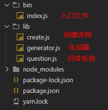
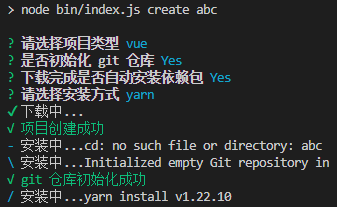
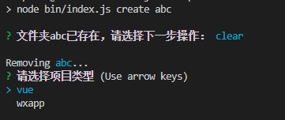

### 背景介绍

每次开发新的项目，类型多样，有`vue`的、也有小程序的，虽然已经有各种类型的项目模板，但每次都需要去下载模板然后修改配置，就显得特别麻烦，于是开发一个脚手架去管理这些项目。

### 解决思路

研究过`vue-cli`的一些代码，它将项目模板和脚手架分离，模板存放在`git`上，然后在与用户交互的时候下载不同的模板，这样模板可以单独维护，即使有更新，也不用更新脚手架。

借鉴`vue-cli`就可以实现简单的项目管理了。

### 依赖库

- [commander](https://github.com/tj/commander.js/blob/HEAD/Readme_zh-CN.md)：解析命令行的命令和参数，用于处理用户输入的指令；
- [Inquirer](https://github.com/SBoudrias/Inquirer.js)：通用的命令行用户界面集合，用于和用户进行交互；
- [download-git-repo](https://www.npmjs.com/package/download-git-repo)：下载`git`仓库；
- [shell](https://github.com/shelljs/shelljs)：`shell`命令执行；
- [ora](https://github.com/sindresorhus/ora)：终端loading动画；
- [chalk](https://github.com/chalk/chalk)：终端样式；
- [log-symbols](https://github.com/sindresorhus/log-symbols)：给终端加上彩色符号；
- [fs-extra](https://github.com/jprichardson/node-fs-extra)：文件操作；

### 初始化

```cmd
yarn init
yarn add commander inquirer download-git-repo handlebars shelljs ora chalk
```

此时目录下就会生成好`package.json`文件，并且安装好相关依赖。



打开`package.json`增加`bin`字段，定义命令名和执行文件

```json
{
  "name": "lp-cli",
 ...
  "bin": {
    "lp-create-project": "bin/index.js"
  },
  "scripts": {
    "test": "node bin/index.js create abc"
  },
  ...
}
```

创建`bin/index.js`文件，并在文件开头写上`#!/usr/bin/env node`，这个代表这个文件是`node`环境下的脚本文件。

### 处理命令行

创建一个命令，输入create即可，使用方法`lp-create-project create [项目名]`

```js
const program = require('commander');

program.version(`lp-cli ${require('../package').version}`).usage('<command> [options]');

program
  .command('create [name]')
  .description('创建一个由lp-cli支持的初始化项目')
  .option('create <项目名>', '创建时输入项目名')
  .action((name) => {
    if(!name){
      console.log(
        `\n  Usage: create [projectName]\n`
      );
      return
    }
  	require('../lib/create')(name);
  });
program.parse(process.argv);
```

入口文件只做命令行处理，具体其它步骤抽离出来。

### 命令行交互

这部分就靠`inquirer`实现，`lib/question.js`构建问答系统，收集交互过程中用户提交选择的信息。

```js
const inquirer = require('inquirer');

module.exports = () => {
  return inquirer.prompt([
    {
      type: 'list',
      message: '请选择项目类型',
      name: 'type',
      choices: ['vue', 'wxapp'],
    },
    {
      type: 'confirm',
      message: '是否初始化 git 仓库',
      name: 'ifGitInit',
      default: true,
    },
    {
      type: 'confirm',
      message: '下载完成是否自动安装依赖包',
      name: 'ifInstall',
      default: true,
    },
    {
      type: 'list',
      message: '请选择安装方式',
      name: 'installWay',
      choices: ['yarn', 'npm'],
      when: (answers) => {
        return answers.ifInstall;
      },
    },
  ]);
};
```

### 功能实现

在`lib/generator.js`生成器中根据用户的输入实现具体的功能。

- 下载项目

```js
const download = require('download-git-repo');
download(gitRepo[this.answers.type], this.answers.name, (err) => {
	if (err) {
		console.log(symbols.error, chalk.red('项目创建失败'));
	} else {
		console.log(symbols.success, chalk.green('项目创建成功'));
	}
});
```

- `git`初始化

```js
const shell = require('shelljs');
shell.cd(this.answers.name).exec('git init', (err) => {
	if (err) {
		console.log('git仓库创建失败');
	} else {
		console.log(symbols.success, chalk.green('git 仓库初始化成功'));
	}
});
```

- 是否安装依赖包

```js
const shell = require('shelljs');
shell.cd(this.answers.name).exec(`${this.answers.installWay == 'yarn' ? 'yarn' : 'npm i'}`, (err) => {
        if (err) {
          console.log('依赖包安装失败');
        } else {
          console.log(symbols.success, chalk.green('依赖包安装成功'));
        }
	});
}
```

### 视觉美化后的完整功能

```js
// 下载模板
const download = require('download-git-repo');
// 命令行操作
const shell = require('shelljs');
// 显示提示图标
const symbols = require('log-symbols');
// 字体加颜色
const chalk = require('chalk');
// 动画效果
const ora = require('ora');

const gitRepo = {
  vue: 'MonsterNO/vue-demp',
  wxapp: 'MonsterNO/pro_template',
};

module.exports = class Generator {
  constructor(answers) {
    this.answers = answers;
  }
  //下载
  downloadGit() {
    let spinner = ora('下载中...');
    return new Promise((resolve, reject) => {
      download(gitRepo[this.answers.type], this.answers.name, (err) => {
        if (err) {
          spinner.fail();
          console.log(symbols.error, chalk.red('项目创建失败'));
          reject(err);
        } else {
          spinner.succeed();
          console.log(symbols.success, chalk.green('项目创建成功'));
          resolve();
        }
      });
    });
  }
  //git初始化
  gitInit() {
    if (this.answers.ifGitInit) {
      shell.cd(this.answers.name).exec('git init', (err) => {
        if (err) {
          console.log(symbols.error, chalk.red(err));
        } else {
          console.log(symbols.success, chalk.green('git 仓库初始化成功'));
        }
      });
    }
  }
  // 安装依赖包
  addPackage() {
    if (this.answers.ifInstall) {
      let spinner = ora('安装中...');
      spinner.start();
      shell.cd(this.answers.name).exec(`${this.answers.installWay == 'yarn' ? 'yarn' : 'npm i'}`, (err) => {
        if (err) {
          spinner.fail();
          console.log(symbols.error, chalk.red(err));
        } else {
          spinner.succeed();
          console.log(symbols.success, chalk.green('依赖包安装成功'));
        }
      });
    }
  }
};
```

### 调用生成器

在`lib/create.js`中调用执行

```js
const Generator = require('./Generator');
module.exports = async (name) => {
  let answers = await question();
  answers.name = name
  let generator = new Generator(answers);
  await generator.downloadGit();
  generator.gitInit();
  generator.addPackage();
};
```



### 优化

- 项目文件夹重复处理

在`lib/create.js`函数调用功能函数前校验项目文件夹是否存在可选择清理文件夹或者不处理。

```js
const fs = require('fs-extra')
const chalk = require('chalk');
const inquirer = require('inquirer');
module.exports = async (name) => {
  if(fs.existsSync(name)){
    let {action} = await inquirer.prompt([
      {
        name:'action',
        type:'list',
        message:`文件夹${name}已存在，请选择下一步操作：`,
        choices:[
          {name:'clear',value:'clear'},
          {name:'cancel',value:false}
        ]
      }
    ])
    if(!action){
      return
    }else{
      console.log(`\nRemoving ${chalk.cyan(name)}...`)
      await fs.remove(name)
    }
  }
};
```



- 考虑下载项目模板可能会出错，加上异常捕获

```js
//异常退出程序 
try {
    await generator.downloadGit();
  } catch (err) {
    process.exit(1)
  }
```

到此这个脚手架的基本功能已经可以正常使用了，同时可以继续研究加入更多的功能，去优化整体的一个功能。

### 发布

最后可以通过`yarn publish` 把脚手架发布到`NPM`上就可以使用了。

[书洞笔记](https://mp.weixin.qq.com/s/-RgxVWDOqvjEq4lcZOVttA)

