## 爆炒鸡心

  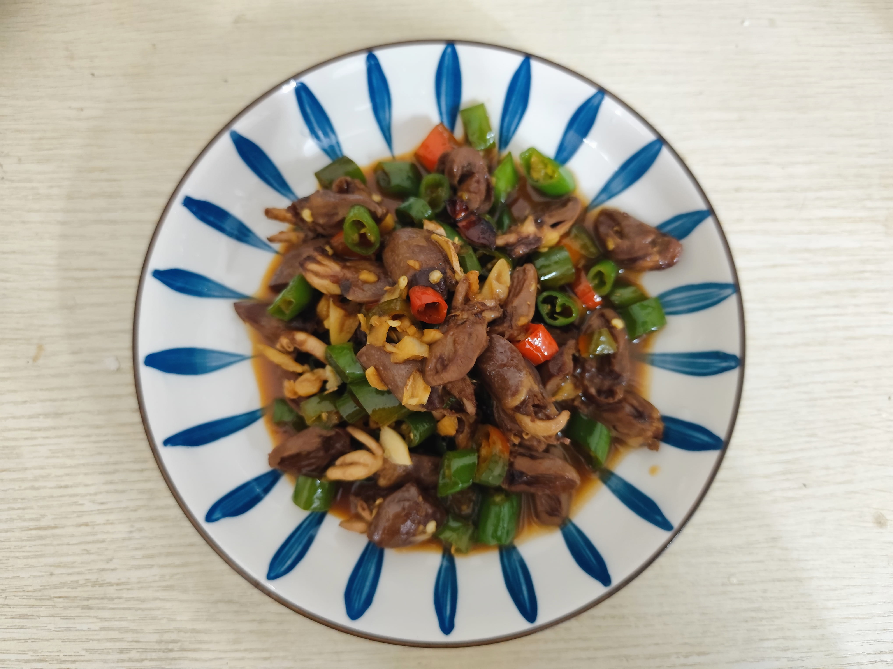
  

## 番茄鸡蛋

## 西兰花炒肉

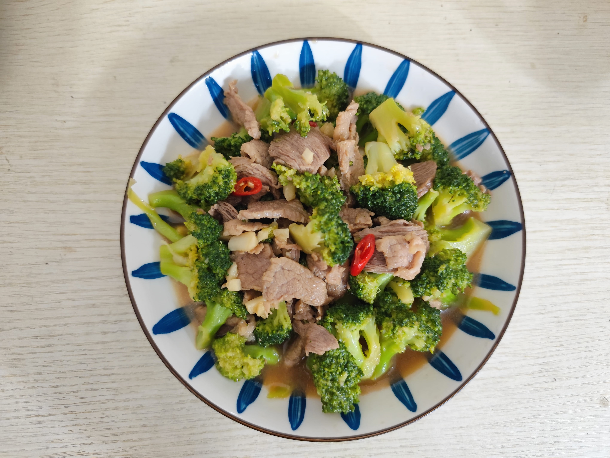  

## 牛肉丸

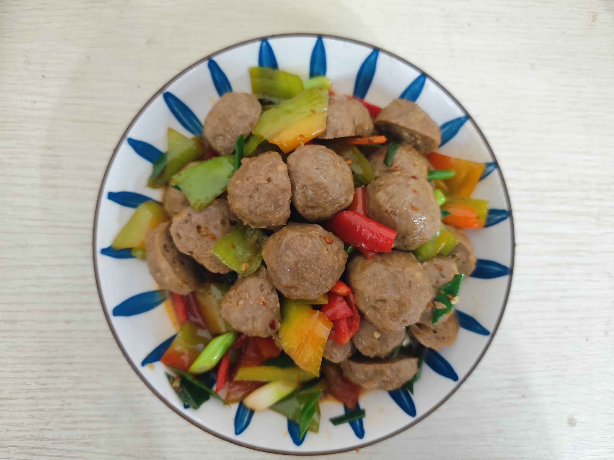

## 苦瓜炒蛋

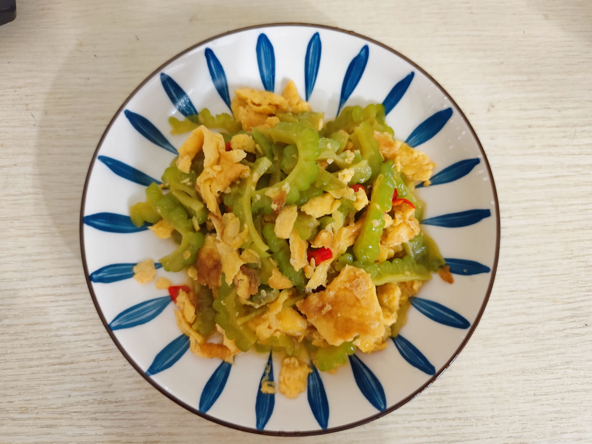

## 蒜苔炒肉

## 佛手瓜

  
  

## 红烧肉

  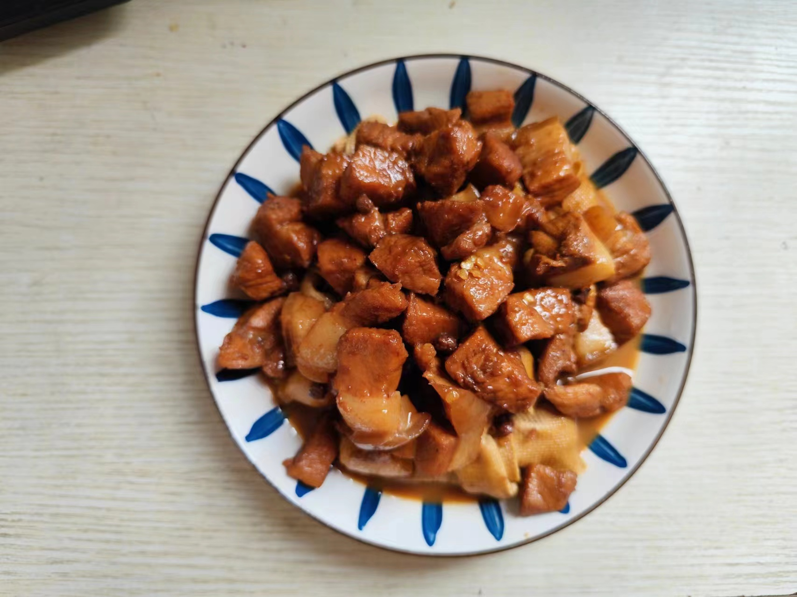
  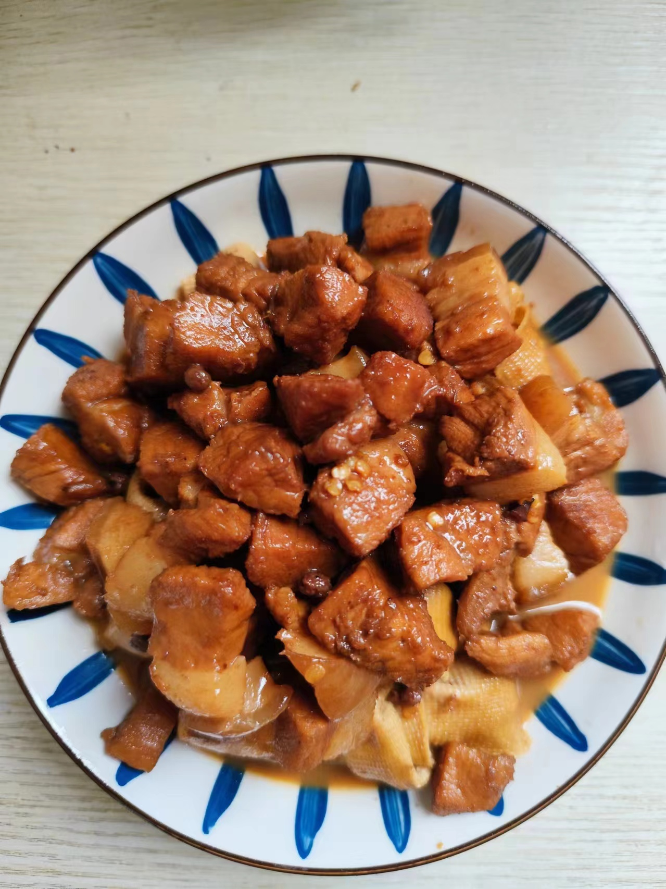

## 手撕鸡

  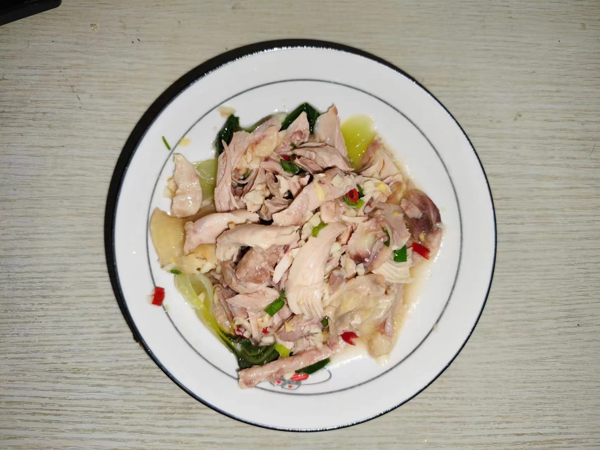
  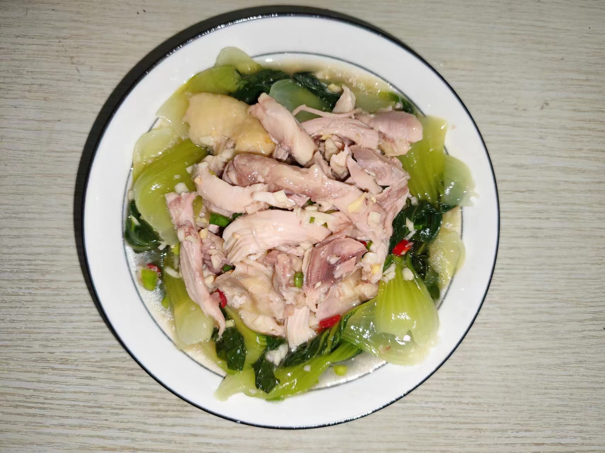

## 竹笋炒腊肉

  
  

## 蒜苔炒花甲

  
  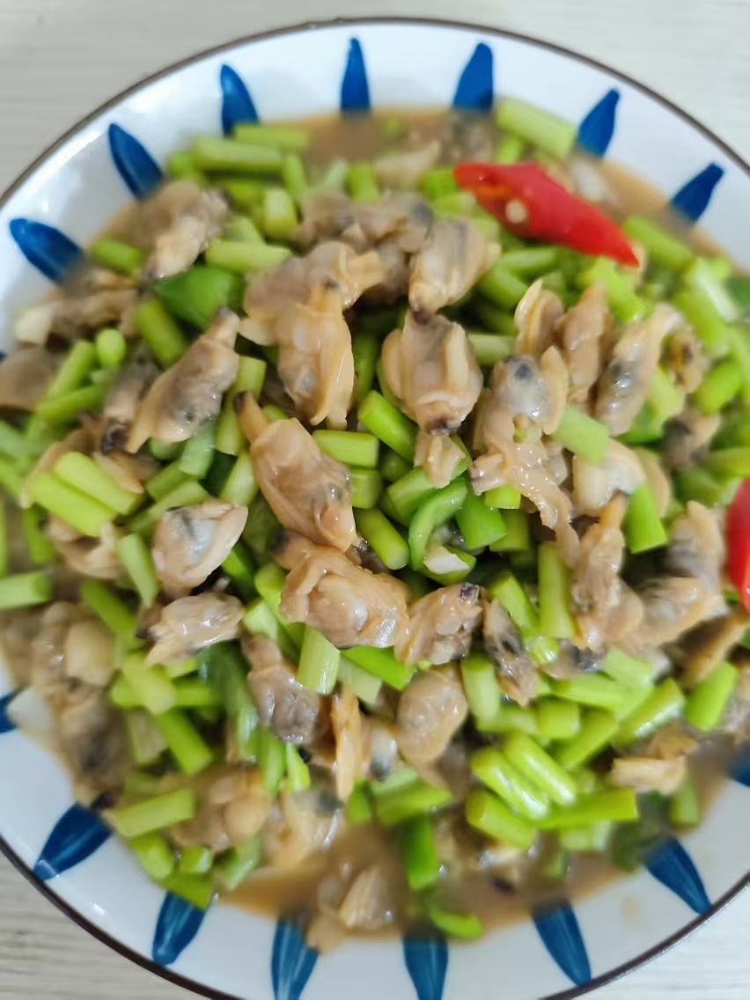

## 卤味

## 土豆炖鸭肉

  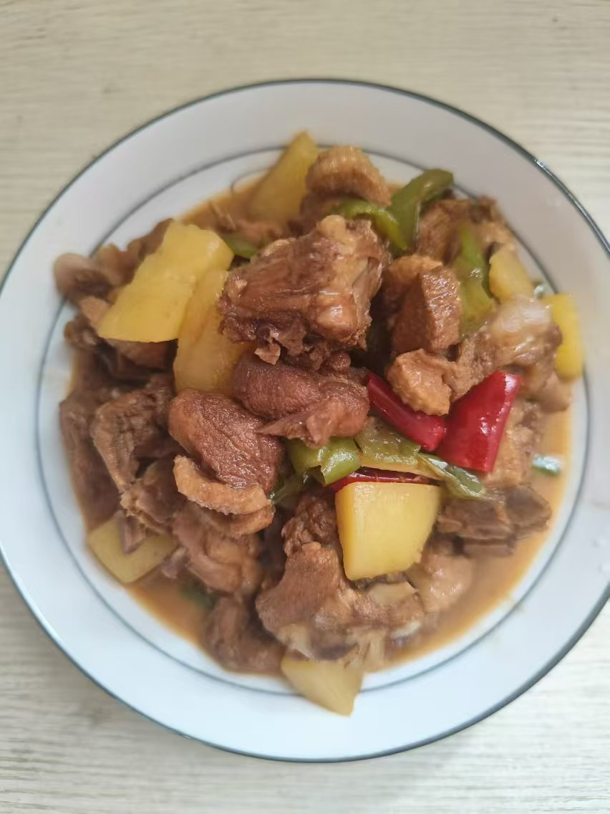
  

## 香菇鸡块

  
  

## 蒜蓉鸡翅

  
  

## 毛豆炒鸡丁

  
  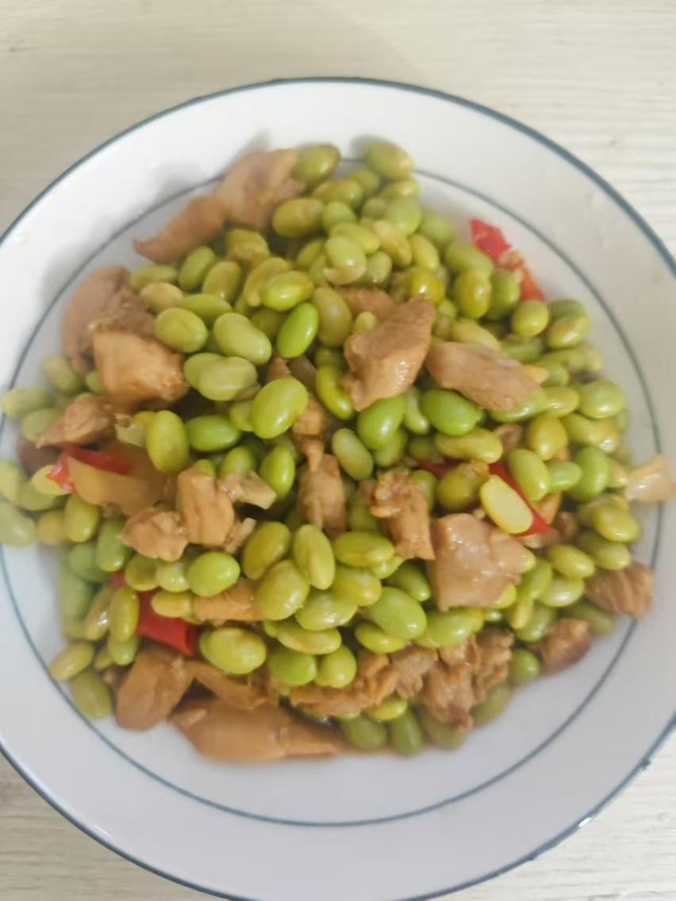

