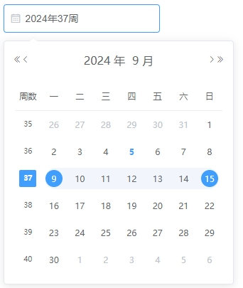
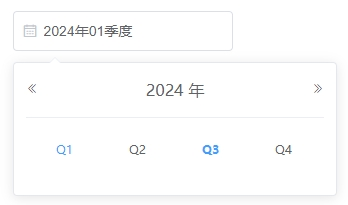
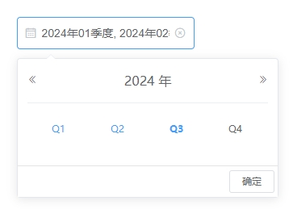
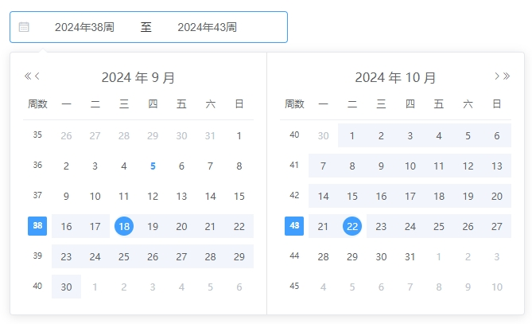
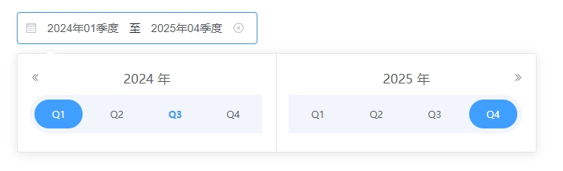
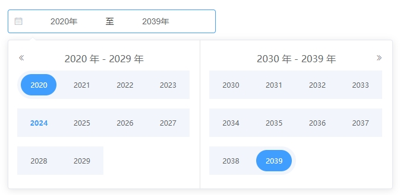

用于选择或输入日期

具体的属性方法请参考官方文档 [DatePicker](https://element.eleme.cn/#/zh-CN/component/date-picker)

## 选择周

以「周」为基本单位，基础的日期选择控件

基本单位有 type 属性指定，`type='week'`

```vue
<lp-date-picker
  v-model="time"
  type="week"
  placeholder="请选择周"
  value-format="yyyy-MM-dd"
  format="yyyy年WW周"
/>
```

<p align="center">
  
</p>

## 选择季度

以「季」为基本单位，基础的日期选择控件

基本单位有 type 属性指定，`type='quarter'`

```vue
<lp-date-picker
  v-model="time"
  type="quarter"
  placeholder="请选择季度"
  value-format="yyyy-MM-dd"
  format="yyyy年QQ季度"
/>
```

<p align="center">
  
</p>

## 选择多个季度

以「季」为基本单位，基础的日期选择控件

基本单位有 type 属性指定，`type='quarters'`

```vue
<lp-date-picker
  v-model="time"
  type="quarters"
  placeholder="请选择多个季度"
  value-format="yyyy-MM-dd"
  format="yyyy年QQ季度"
/>
```

<p align="center">
  
</p>

## 选择周范围

可在一个选择器中便捷地选择一个周范围

基本单位有 type 属性指定，`type='weekrange'`

```vue
<lp-date-picker
  v-model="time"
  type="weekrange"
  range-separator="至"
  start-placeholder="开始周"
  end-placeholder="结束周"
  value-format="yyyy-MM-dd"
  format="yyyy年WW周"
/>
```

<p align="center">
  
</p>

## 选择季度范围

可在一个选择器中便捷地选择一个季度范围

基本单位有 type 属性指定，`type='quarterrange'`

```vue
<lp-date-picker
  v-model="time"
  type="quarterrange"
  range-separator="至"
  start-placeholder="开始季度"
  end-placeholder="结束季度"
  value-format="yyyy-MM-dd"
  format="yyyy年QQ季度"
/>
```

<p align="center">
  
</p>

## 选择年度范围

可在一个选择器中便捷地选择一个年度范围

基本单位有 type 属性指定，`type='yearrange'`

```vue
<lp-date-picker
  v-model="time"
  type="yearrange"
  range-separator="至"
  start-placeholder="开始年度"
  end-placeholder="结束年度"
  value-format="yyyy-MM-dd"
  format="yyyy年"
/>
```

<p align="center">
  
</p>

## 日期格式

使用format指定输入框的格式；使用value-format指定绑定值的格式。

| 格式 | 含义 | 备注 | 举例 |
| :---: | :---: | :---: | :---: |
| Q | 季 | 不补0 | 1 |
| QQ | 季 |  | 01 |
| QQQ | 季 | 加季度Q前缀 | Q1 |

## 额外处理

1. 解决周选择器无法设置value-format

周选择器设置value-format后value格式是正确了，但是控制台报错，组件不回显。从报错信息可以看出来，都是显示获取操作时间函数，因为现在的值是字符串当然没有这些方法，官方没有对周模式进行兼容。**通过重写方法解决此问题**。

