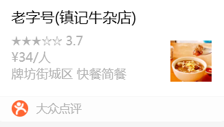
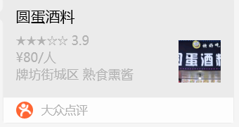
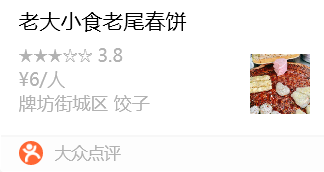
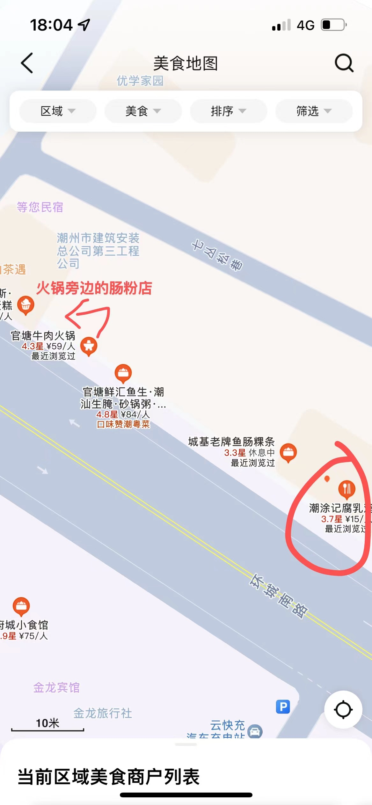
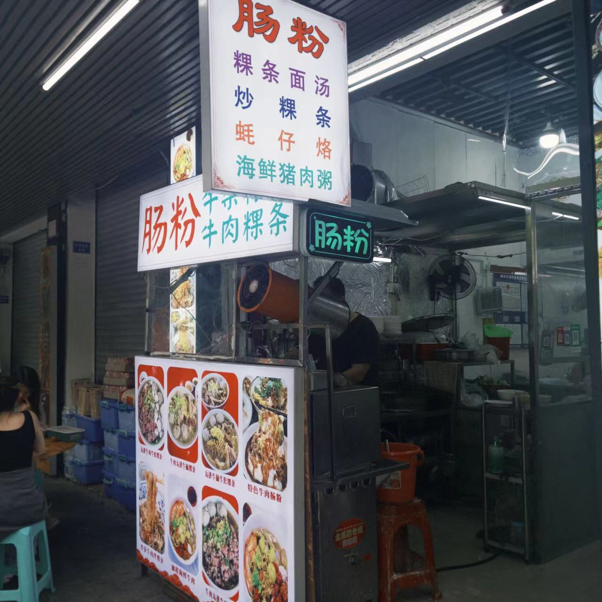

## 必吃榜单

### 潮涂记腐乳鸡翅（环城南店）

### 镇记老尾牛杂粿条

### 老尾十八曲鱼皮饺

古城

### 潮汕生腌

### 蚝烙

西马路/牌坊街

### 牛肉火锅

### 水果冰

### 饼

### 肠粉

## 感受潮州文化

### 潮州古城

### 牌坊街

### 湘子桥

桥上有非遗展览的，下午 3 点多去湘子桥，一般四点半有表演桥梁开启闭合。湘子桥要走完，桥上有各种非遗展示，晚上八点会有灯光秀表扬

### 韩文公祠博物馆

### 许附马府

### 己略黄公祠

### 潮州西湖公园

中山路

后面的非遗一条街

### 茶馆

喝潮州功夫茶，听潮剧
