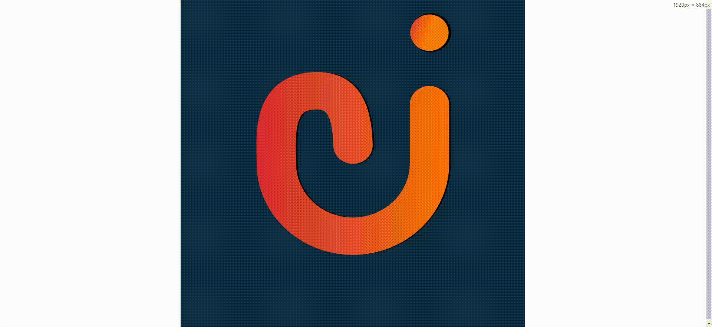
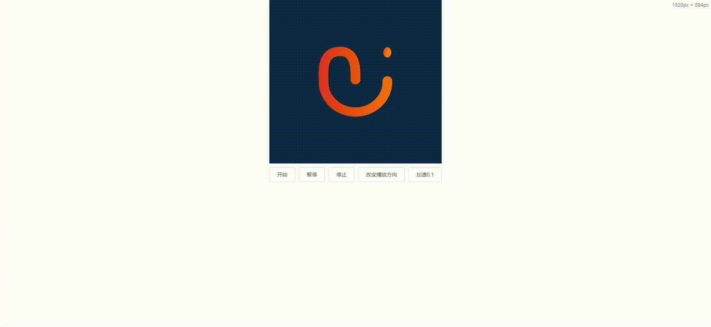

### 前言

前端页面为了美观、交互，会在页面加上一些交互动画。一般动画的实现方式有这几种：

- css + js：实现简单的动画还是可以的，但是实现复杂动画还是很痛苦的；
- gif图：简单粗暴的方式就是放一张gif图；
- Lottie动画：根据json文件进行动画播放；
- ......

### Lottie动画

**Lottie** 是一个应用十分广泛动画库，适用于Android、iOS、Web、ReactNative、Windows的库，它解析了用Bodymovin导出为json的Adobe After Effects动画，并在移动和网络上进行了原生渲染。其和 GSAP 这类专注动画曲线、插值等js动画库不同，它本质上是一套跨平台的平面动画解决方案。

- [官方文档](http://airbnb.io/lottie/#/web)
- [lottie精选动画](https://lottiefiles.com/featured)

### 使用

使用Lottie需要对应的json动画文件，可以由设计师使用AE制作动画然后使用 Bodymovin 插件导出为json文件，还可以使用lottie社区提供的精选动画[https://lottiefiles.com/featured](https://lottiefiles.com/featured)下载json文件即可。

- 安装

```bash
npm install lottie-web --save
```

- 引入

```javascript
import lottie from 'lottie-web'
```

#### 基本操作

```html
<template>
 <div ref="lottieRef"></div>
</template>
<script>
import lottie from 'lottie-web'
export default {
  name: 'Lottie',
  mounted() {
    this.init()
  },
  methods: {
    init() {
      const animation = lottie.loadAnimation({
        container: this.$refs.lottieRef,
        renderer: 'canvas',// 渲染方式：svg、canvas
        loop: true,  // 循环播放，默认：false
        path: '/lottie.json'  // json 路径
      })
    }
  }
}
</script>
```




#### 配置参数

| 参数          | 说明                     |
| ------------- | ------------------------ |
| name          | 供将来参考的动画名称     |
| container     | dom容器                  |
| renderer      | 渲染方式：svg、canvas    |
| loop          | 循环播放                 |
| autoplay      | 自动播放                 |
| path          | json动画文件(必填)       |
| animationData | 包含导出的动画数据的对象 |

**注意：** path和animationData互斥

```js
//path使用
 const animation = lottie.loadAnimation({
	container: this.$refs.lottieRef,
	renderer: 'canvas',// 渲染方式：svg、canvas
	loop: true,  // 循环播放，默认：false
	path: '/lottie.json'  // json 路径
})

//animationData使用
import lottieData from './lottie.json'
const animation = lottie.loadAnimation({
	container: this.$refs.lottieRef,
	renderer: 'canvas',// 渲染方式：svg、canvas
	loop: true,  // 循环播放，默认：false
	animationData: lottieData
})
```

#### 常用方法

```js
animation.play(); // 播放，从当前帧开始播放

animation.stop(); // 停止，并回到第0帧

animation.pause(); // 暂停，并保持当前帧

animation.goToAndStop(value, isFrame); // 跳到某个时间/帧并停止，isFrame(默认false)指示value表示帧还是时间(毫秒)

animation.goToAndPlay(value, isFrame); // 跳到某个时刻/帧并进行播放

animation.playSegments(arr, forceFlag); // arr可以包含两个数字或者两个数字组成的数组，forceFlag表示是否立即强制播放该片段

animation.setSubframe(flag);// -- 如果为 false，它将遵循原始 AE fps。如果为 true，它将尽可能多地更新。（默认为 true

animation.setSpeed(speed); // 设置播放速度，speed为1表示正常速度

animation.setDirection(direction); // 设置播放方向，1表示正向播放，-1表示反向播放

animation.destroy(); // 删除该动画，移除相应的元素标签等。在unmount的时候，需要调用该方法
```

#### 事件

- onComplete
- onLoopComplete
- onEnterFrame
- onSegmentStart

 还可以将 addEventListener 与以下事件一起使用 

- complete：完成
- loopComplete：循环完成
- enterFrame
- segmentStart
-  config_ready  ： 初始配置完成后 
-  data_ready ： 加载动画的所有部分后 
-  DOMLoaded ： 当元素已添加到 DOM 时 
- destroy：销毁

### 预览




Lottie可以使前端方便的调用动画，并对动画进行控制，高度还原动画，性能还是不错的。可以根据具体的情况来决定使用什么方式实现动画效果。

[书洞笔记](https://mp.weixin.qq.com/s/W8VqbUmj1wW-NkTwW1hjLg)
