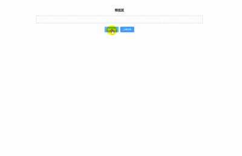
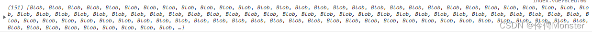

文件上传是项目中必不可少的功能，这里总结了一些常用的功能。
## 基础上传
### 样式布局

```html
<div class="container">
	<div class="title">预览区</div>
		<div class="preview">
			<el-image
			class="img"
			v-for="(item, index) in tempList"
			:key="index"
			:src="item"
			:preview-src-list="tempList"
			/>
		</div>
	<el-button type="primary" size="small" @click="fileUploadNode">选择文件</el-button>
	<el-button type="primary" size="small">上传文件</el-button>
</div>
```

### 文件选择

这里是推荐使用动态创建input选择文件

```js
//创建input获得file文件
fileUploadNode() {
	// 创建input标签
	const input = document.createElement("input");
	//设置input样式
	input.style =
        "display: block; width: 0; height: 0; padding: 0; border: 0;";
	//设置input为file类型
	input.setAttribute("type", "file");
	//设置input name
	input.setAttribute("name", "file");
	//是否多选
	input.setAttribute("multiple", true);
	document.body.appendChild(input);
	input.addEventListener("change", (e) => {
        //保存选择的文件
		this.files = e.target.files;
        //实现预览
        this.transImg(this.files);
        setTimeout(() => {
          document.body.removeChild(input);
        });
      });
	input.click();
}
```

### 实现预览

```js
transImg(files) {
	let list = [];
	for (let i = 0; i < files.length; i++) {
		const reader = new FileReader();
        reader.addEventListener(
          "load",
          () => {
            list.push(reader.result);
          },
          false
        );
        reader.readAsDataURL(files[i]);
      }
	this.tempList = list;
}
```


### 上传文件

```js
upload() {
	const formData = new FormData();
	formData.append("file", this.files[0]);
	axios({
		url: "http://127.0.0.1:3000/upload",
        method: "post",
        data: formData
      }).then((res) => {
        console.log(res.data);
        this.files = null;
        this.tempList = []
      });
}
```

## 上传进度

`axios`已经有对应的方法，只需要改造一下即可

```js
axios({
	url: "http://127.0.0.1:3000/upload",
	method: "post",
	data: formData,
	//添加上传处理进度事件
	onUploadProgress: (e) => {
		this.progress = (e.loaded / e.total) * 100;
	},
}).then((res) => {
	console.log(res.data);
	this.files = null;
	this.$message({
		message: "上传成功",
		type: "success",
	});
});
```


## 拖拽上传

其实input是支持拖拽选择文件的，但是这里使用另外一种方式。

- 绑定事件

```html
<div class="preview" @dragenter="dragenter"@dragover="dragover"@drop="drop">
	拖拽区域
</div>
```

- 阻止默认事件

给盒子添加这三个事件后，这个盒子就变成可拖拽容器，注意要阻止默认事件

```js
dragenter(e) {
	e.preventDefault();
},

dragover(e) {
	e.preventDefault();
},

drop(e) {
	e.preventDefault();
},
```

- 获取文件

具体的操作可以根据自己的业务去做处理，`e.dataTransfer.files`可以获取拖拽后的文件

```js
drop(e) {
	e.preventDefault();
	let files = e.dataTransfer.files
	if (!e.dataTransfer.types.includes("Files")) {
		this.$message({
			message: "仅支持拖拽文件",
			type: "warning",
		});
		return;
	}
	if(files.length !== 1){
		this.$message({
			message: "仅支持上传单个文件",
			type: "warning",
		});
		return;
	}
	this.files = e.dataTransfer.files;
	this.transImg(this.files);
}
```

## 大文件上传

大文件上传也就是对文件进行分片上传，有几个关键点：如何切片、如何检测切片是否上传

- 切片上传

```js
 /**
     *文件分片
     * @param {文件} file
     * @param {切片大小} chunkSize
     */
    createChunks(file, chunkSize) {
      let result = [];
      for (let i = 0; i < file.size; i += chunkSize) {
        result.push(file.slice(i, i + chunkSize));
      }
      return result;
    }
```

封装一个切片方法，传入一个文件以及切片大小就会返回一个切片数组

- 计算文件hash

需要计算出文件的hash，这样通过文件hash就能知道当前这个文件分片上传的情况

```bash
# 安装MD5包
npm i spark-md5
```

这里计算文件hash通过分片计算，计算hash需要读取文件，如果遇到大文件电脑性能吃不消。

```js
import SparkMD5 from "spark-md5";

/**
     * 计算hash
     * @param {分片数组} chunks
     */
    hash(chunks) {
      return new Promise((resolve, reject) => {
        let spark = new SparkMD5();
        function _read(i) {
          if (i >= chunks.length) {
            resolve(spark.end());
            return;
          }
          let blob = chunks[i];
          let reader = new FileReader();
          reader.onload = (e) => {
            let byts = e.target.result;
            spark.append(byts);
            _read(i + 1);
          };
          reader.readAsArrayBuffer(blob);
        }
        _read(0);
      });
    },
```

通过递归的方式递归读取文件，最后使用`spark.end()`获得最终计算的hash值，因为是异步操作可以使用`Promise`返回。

这样上传大文件的时候就可以通过hash去检测，如果上传完就合并文件，如果没有上传完成就可以根据后端返回的分片索引继续上传。核心功能就是这两个，具体需要根据不同业务结合后端完成文件上传。
[书洞笔记](https://mp.weixin.qq.com/s/S0V7dTc_UWdVz0zHAVgfcw)
